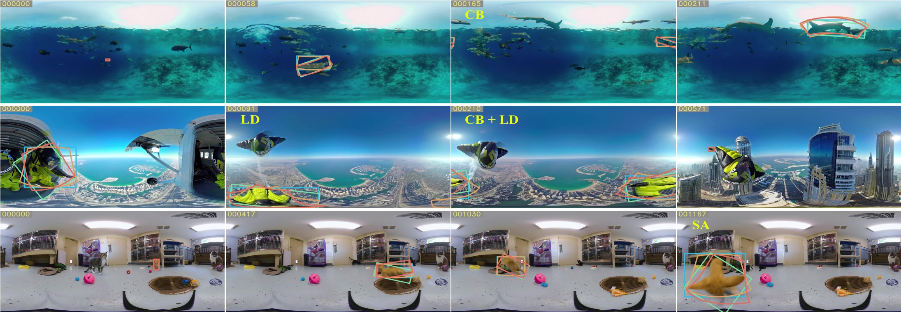
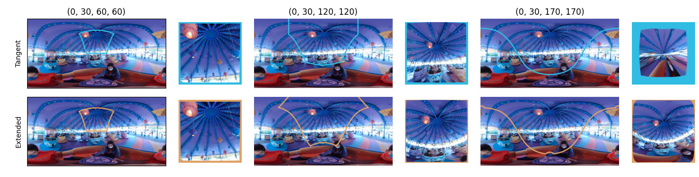
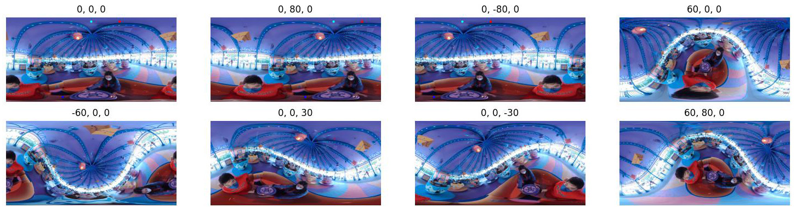
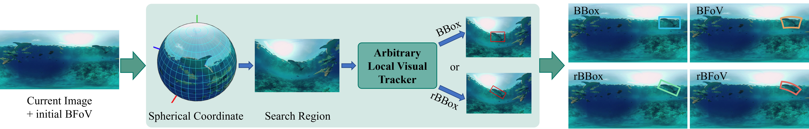
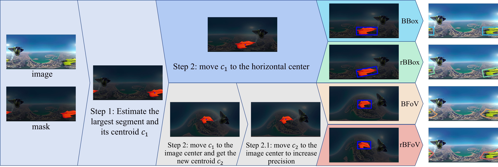
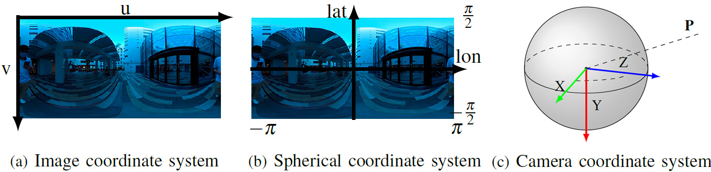

# 360VOT: Omnidirectional Visual Object Tracking
### [Homepage](https://360vot.hkustvgd.com/) | [Paper](https://arxiv.org/abs/2307.14630) | [Video](https://youtu.be/PKAVzyGBJMw) | [Benchmark Dataset](https://360vot.hkustvgd.com/download)

**360VOT: A New Benchmark Dataset for Omnidirectional Visual Object Tracking** <br>
[Huajian Huang](https://huajianup.github.io), Yinzhe Xu, [Yingshu Chen](https://chenyingshu.github.io) and [Sai-Kit Yeung](https://saikit.org/) <br>
The Hong Kong University of Science and Technology <br>
In Proceedings of the IEEE/CVF International Conference on Computer Vision (ICCV2023) <br>




## Introduction
The proposed 360VOT is the first benchmark dataset for omnidirectional visual object tracking. 360VOT contains `120` sequences with up to 113K high-resolution frames in equirectangular projection. It brings distinct challenges for tracking, e.g., crossing border (CB), large distortion (LD) and stitching artifact (SA). We explore new representations for visual object tracking and provide four types of unbiased ground truth, including bounding box (${\textcolor{#30bce3}{BBox}}$), rotated bounding box (${\textcolor{#79e0a7}{rBBox}}$), bounding field-of-view (${\textcolor{#e0a165}{rBBox}}$), rotated bounding field-of-view (${\textcolor{#e06b60}{rBFoV}}$). We propose new metrics for omnidirectional tracking evaluation, which measure the dual success rate and angle precision on the sphere. By releasing 360VOT, we believe that the new dataset, representations, metrics, and benchmark can encourage more research and application of omnidirectional visual object tracking in both computer vision and robotics.

## Installation
To use the toolkit,
```Bash
git clone https://github.com/HuajianUP/360VOT.git
cd 360VOT
pip install -r requirements.txt
```

Currently, the toolkit uses [Rotated_IoU](https://github.com/lilanxiao/Rotated_IoU) to calculate `rBBox IoU` for evaluation. When you seek to evaluate the tracking results in term of `rBBox`, you should install [Rotated_IoU](https://github.com/lilanxiao/Rotated_IoU).
```
git submodule add https://github.com/lilanxiao/Rotated_IoU eval/Rotated_IoU
```

## Usage

### Evaluation on 360VOT dataset
Please use the following structure to store tracking results. The subfolders `tracker_n/` contain tracking results (`.txt` files) of distinct methods on 120 sequences. The data format for different tracking representations in the txt file: `BBox` is `[x1 y1 w h]`, `rBBox` is `[cx cy w h rotation]`, `BFoV` and `rBFoV` are `[clon clat fov_horizontal fov_vertical rotation]`. All the angle values are in a degree manner, e.g., 'BFoV=[0 30 60 60 10]'.

```
results
├── traker_1
│   ├── 0000.txt
│   ├── ....
│   └── 0120.txt
├── ....
│
└── traker_n
    ├── 0000.txt
    ├── ....
    └── 0120.txt
```

For quick testing, you can download the benchmark [results](https://hkustconnect-my.sharepoint.com/:u:/g/personal/hhuangbg_connect_ust_hk/EV8bjxyaFXVMtByTf95ttWIB4IQSRz3qfM9zZ-NCzFIbrQ?e=XgqgHQ) and unzip them in the folder `benchmark/`. If you have not downloaded the 360VOT dataset, you also need to download the [Dataset](https://360vot.hkustvgd.com/download). Then, you can evaluate the BFoV results using the command:

```
python scripts/eval_360VOT.py -f benchmark/360VOT-bfov-results -d PATH_TO_360VOT_DATASET
```


<details>
<summary><span style="font-weight: bold;">Command Line Arguments for eval_360VOT.py</span></summary>

| Args             | Meaning       |
| :-------------: | ------------- |
| -d / --dataset_dir| Path to 360VOT dataset. |
| -b / --bbox_dir   | Specify the path to the bbox results when you evaluate the results in bbox. |
| -rb / --rbbox_dir | Specify the path to the rbbox results when you evaluate the results in rbbox. |
| -f / --bfov_dir   | Specify the path to the bfov results when you evaluate the results in bfov. |
| -rf / --rbbox_dir | Specify the path to the rbfov results when you evaluate the results in rbfov. |
| -a / --attribute | Specify the path to the 360VOT_attribute.xlsx, when you evaluate the results regarding different attributes. |
| -v / --show_video_level | Print metrics in detail. |
| -p / --plot_curve | Plot the curves of metrics. |
| -s / --save_path | Specify the path to save the figure of metrics. |

</details>

Command for visualizing the results and making a video:
```
# visualize the ground truth
python scripts/vis_result.py -d PATH_TO_DATASET -p PATH_TO_SAVE_VIDEOS [-ss VIDEO_OF_SPECIFIC_SEQUENCE]

# visualize the tracking results
python scripts/vis_result.py -d PATH_TO_DATASET -p PATH_TO_SAVE_VIDEOS -f PATH_TO_BFOV_RESULTS [-ss VIDEO_OF_SPECIFIC_SEQUENCE]
```

Command for checking parts of attributes of 360VOT dataset:
```
python scripts/check_360VOT_attribute.py --dir PATH_TO_DATASET [--excel PATH_TO_360VOT_attribute.xlsx]
```
### Processing 360-degree image (equirectangular)
The toolkit contains an essential library for processing 360<sup>o</sup> images. The operations include:

`crop_bfov`: to extract the region of given `(r)BFoV` from the 360<sup>o</sup> image.

`plot_bfov`: to plot the region of given `(r)BFoV` on the 360<sup>o</sup> image.

<details>
<summary><span style="font-weight: bold;">Example</span></summary>
    

    
</details>

`crop_bbox`: to extract the region of given `(r)BBox` from the 360<sup>o</sup> image.

`plot_bbox`: to plot the region of given `(r)BBox` on the 360<sup>o</sup> image.

`rot_image`: to rotate the image by the pitch, yaw, or roll angle. 
<details>
<summary><span style="font-weight: bold;">Example</span></summary>
 

    
</details>

`localBbox2Bfov`: convert the `(r)BBox` predictions on the extracted region to `(r)BFoV` regarding the original 360<sup>o</sup> image.

`localBbox2Bbox`: convert the `(r)BBox` predictions on the extracted region to `(r)BBox` regarding the original 360<sup>o</sup> image.
<details>
<summary><span style="font-weight: bold;">Example</span></summary>
 


</details>

`mask2Bfov`: estimate the `(r)BFoV` from the masked images.

`mask2Bbox`: estimate the `(r)BBox` from the masked images.
<details>
<summary><span style="font-weight: bold;">Example</span></summary>
 


</details>

For more examples, please refer to `scripts/test_omni.py`

<br>
We use a spherical camera model to formulate the relationship between the 2D image and the 3D camera coordinate system. 
<details>
<summary><span style="font-weight: bold;">Illustration of coordinate system</span></summary>
 


Image Credit: [360VO](https://huajianup.github.io/research/360VO/)
</details>


## Citation
If you use 360VOT and this toolkit for your research, please reference:
```bibtex
@InProceedings{huang360VOT,
   author    = {Huajian Huang, Yinzhe Xu, Yingshu Chen and Sai-Kit Yeung},
   title     = {360VOT: A New Benchmark Dataset for Omnidirectional Visual Object Tracking},
   booktitle = {Proceedings of the IEEE/CVF International Conference on Computer Vision (ICCV)},
   month     = {October},
   year      = {2023},
   pages     = {}
}
```
 